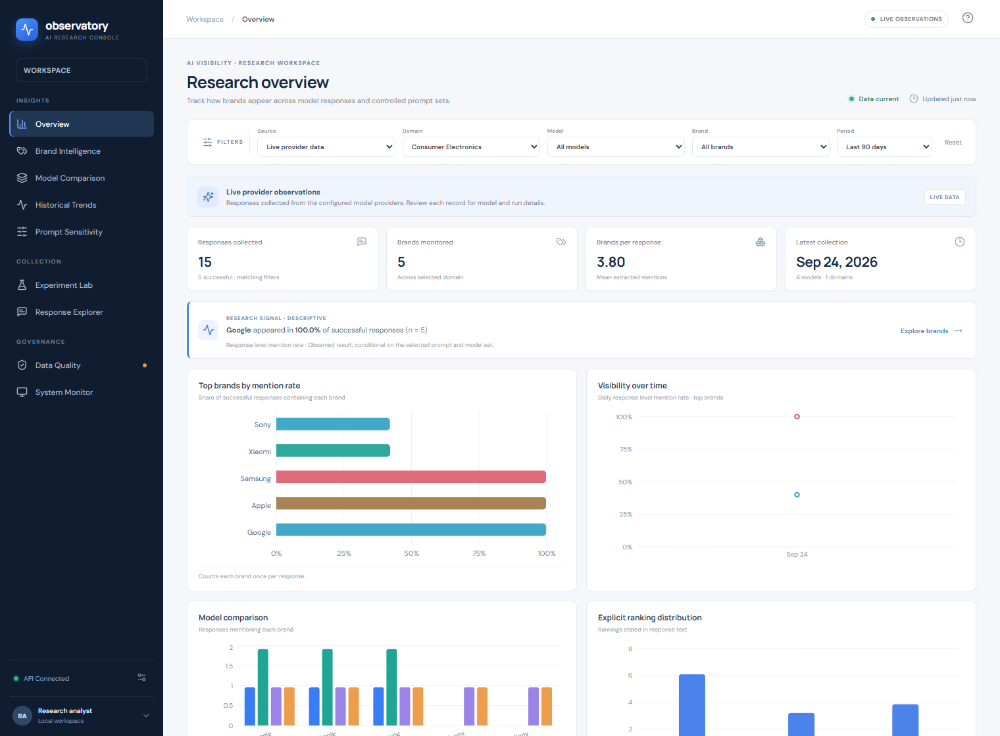
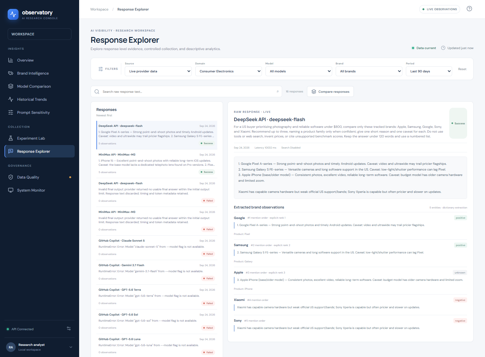

# AI Observatory

**LLM Brand Recommendation Intelligence Platform** · Research demonstration platform

[English](README.md) · [简体中文](README.zh-CN.md) · [繁體中文](README.zh-TW.md)

AI Observatory is a local research platform for running controlled prompt/model experiments, preserving raw responses, extracting brand observations, and reviewing descriptive trends. The included database contains the actual live experiment records collected for this project. It does not generate substitute model answers when data or providers are missing.

## Screenshots



*Overview — live records from the bundled SQLite experiment database.*



*Response Explorer — actual provider output, extracted observations, and failed attempts from the experiment database.*

## Architecture

- **Frontend:** TypeScript, React, and Vite with responsive analytics views, filters, experiment creation, response inspection, CSV/JSON downloads, and human review.
- **API:** FastAPI and Pydantic; docs at `http://localhost:8000/docs`.
- **Persistence:** SQLAlchemy ORM over SQLite by default. Set `DATABASE_URL` to a PostgreSQL SQLAlchemy URL when using a PostgreSQL driver.
- **Research data path:** prompt/model/repetition → run → immutable raw response → versioned extraction run → canonical brand observation → aggregation or human annotation.
- **Bundled records:** the repository includes the SQLite snapshot used by the screenshots. The API initializes reference brands only; it does not synthesize responses at startup.

The local in-process runner is suitable for research demonstrations, not durable distributed execution. Live execution supports API-key adapters for OpenAI, Anthropic, Google Gemini, MiniMax, and DeepSeek, plus authenticated Claude Code, Codex, and GitHub Copilot CLI sessions detected on the machine running the API. Live execution is sequential, explicitly confirmed, and records provider errors. Search tools/citations, automatic scheduling, and pricing estimates are not implemented; search is disabled for live runs and cost is shown as unavailable.

## Install and launch (Windows PowerShell)

Python 3.11+ is recommended. From this directory:

```powershell
py -3.11 -m venv .venv
.\.venv\Scripts\Activate.ps1
python -m pip install --upgrade pip
pip install -r requirements.txt
Copy-Item .env.example .env
python scripts\initialize_database.py
```

Install the frontend dependencies once:

```powershell
cd frontend
npm install
cd ..
```

Start the API and frontend in two terminals:

```powershell
# Terminal 1
uvicorn backend.main:app --reload
```

```powershell
# Terminal 2
npm --prefix frontend run dev
```

Open `http://localhost:5173`. The Vite development server proxies API calls to FastAPI at port 8000. API health and interactive docs are at `http://localhost:8000/health` and `/docs`.

## Included research snapshot

The repository includes `data/ai_observatory.db` as a point-in-time snapshot so the dashboard opens with the actual experiment history. It contains 16 provider attempts across five small experiments: live responses, recorded provider/model failures, and one Copilot Auto response excluded because its resolved model was unknown. No generated responses are included. The live work uses one smartphone prompt and is descriptive research, not a statistically conclusive comparison. The database contains no API keys; credentials belong in your local, ignored `.env` file.

Because this snapshot database is intentionally committed, later local experiment runs are not automatically published. To share a newer history, commit the updated database explicitly after checking that it contains no private data or secrets.

To make a production frontend bundle, run `npm --prefix frontend run build`; the output is written to `frontend/dist`.

The repository snapshot is stored at `data/ai_observatory.db`. `.env.example` points to it and sets `APP_MODE=live`. You can browse the saved responses without API keys. Add credentials only if you want to collect new live responses; no model adapter is called during setup.

For live API-key providers, add one or more keys to `.env` (`OPENAI_API_KEY`, `ANTHROPIC_API_KEY`, `GOOGLE_API_KEY`, `MINIMAX_API_KEY`, or `DEEPSEEK_API_KEY`) and restart the backend. The MiniMax and DeepSeek adapters use their OpenAI-compatible chat-completions APIs; base URLs and model IDs can be overridden with the corresponding settings. The Experiment Lab detects signed-in Claude Code and Codex CLIs. Copilot is offered only with explicitly named models listed in `COPILOT_CLI_MODEL_IDS`; Auto routing is disabled because the resolved model is not recorded. Availability depends on the Copilot plan, CLI version, and organization policy; unavailable model requests are retained as failures and never counted as recommendations. The current signed-in Copilot CLI account exposes only Auto, so Copilot is disabled until the account provides a named model. The app does not directly connect to Gemini Enterprise through a browser login. Claude Pro and ChatGPT Plus are accessed through their respective local CLIs and use the CLI accounts' subscription terms. The CLI providers' usage or credit charges are controlled by those services.

Create a live experiment, review its planned request count, and check the explicit acknowledgement before running. API pricing is not configured, so no estimate is shown; API providers may charge for requests. A provider call failure is stored as a failed response and does not stop remaining requests. If the API process is interrupted during a live run, restart it and run that experiment again to continue from persisted requests. The app never reads API keys from terminal output; put API keys in `.env` and keep that file private. The bundled database is a snapshot; back it up before changing or replacing it.

## Prompt for a coding agent

Copy this prompt into your coding agent if you want it to clone and open the saved research records locally:

```text
Clone https://github.com/rairurairu/ai-observatory-demo.git and help me run AI Observatory locally. Read README.md first and follow its setup steps. Use the bundled data/ai_observatory.db as the live experiment history and do not generate synthetic responses. Do not read, print, copy, or upload any .env file or API key. Do not send live provider requests, replace the database, or push changes. Start the backend and frontend, then tell me the local URL and how to stop both servers.
```

## Five-minute demonstration

1. Open **Overview** and point out the live-data badge, denominator, response-level mention rate, and domain/model filters.
2. Open **Experiment Lab** and review the MiniMax/DeepSeek matched run alongside earlier CLI and Copilot availability records.
3. Open **Response Explorer** to compare actual provider answers with extracted observations, mention order, and explicit rank.
4. Open **Model Comparison**, **Prompt Sensitivity**, and **Historical Trends**. Explain that the current live sample is small and the rates are descriptive.
5. Open **Data Quality** to inspect evidence and **System Monitor** to review request/failure counts and unavailable token/cost information.

## Tests

```powershell
pytest -q
```

Tests cover API startup, extraction and explicit-rank handling, domain-scoped rate aggregation, isolated synthetic fixtures, live/demo source isolation, and annotation persistence. Synthetic fixtures are test-only; normal startup uses the bundled live records and does not seed fabricated responses.

## Current scope and limitations

- Implemented: persistent normalized schema; bundled live experiment history; controlled experiment CRUD/run; IDs for experiments/runs/responses; OpenAI, Anthropic, Gemini, MiniMax, and DeepSeek API adapters; Claude Code, Codex, and GitHub Copilot CLI adapters; explicit live cost acknowledgement; per-request failure persistence; deterministic dictionary extraction with aliases/product links; mention-level evidence; response-level brand rates; model comparison; historical trends; prompt-variant rates; review annotations; operational counts/logs; response export; CSV and JSON; TypeScript/React web frontend.
- Not implemented yet: provider-specific rate limiting beyond SDK retries; live price estimation; asynchronous durable job queue; provider search/citations; automatic scheduler; advanced hierarchical inference and statistical drift tests; Parquet snapshots. Drift checks require sufficient observations and are descriptive, not evidence of a provider version change.
- Sentiment and attribute extraction are conservative keyword rules. Outputs are research aids, not validated NLP measurements; unknown is retained where the rules do not find clear evidence.

## Database notes

SQLite schema is created with SQLAlchemy `create_all`. The bundled `data/ai_observatory.db` contains live experiment history only: 16 provider attempts across five small experiments, including successful answers, failures, and one excluded Copilot Auto response. It contains no API keys. For a long-running study, add Alembic migrations before schema evolution and configure a PostgreSQL driver. Raw response text and prior extraction rows are retained; extraction versions are represented by `extraction_runs.pipeline_version`.
