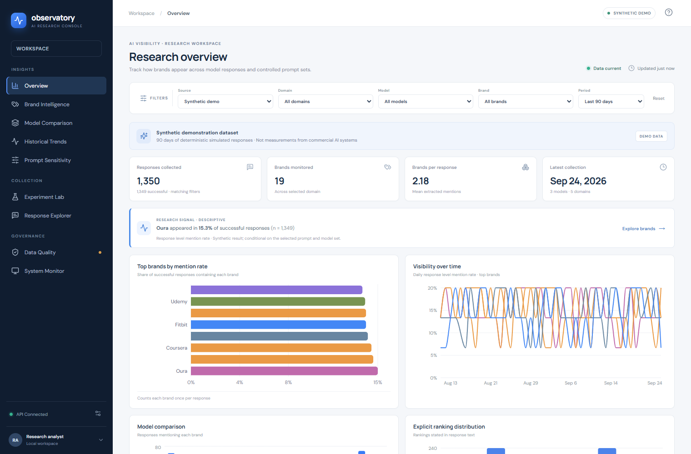
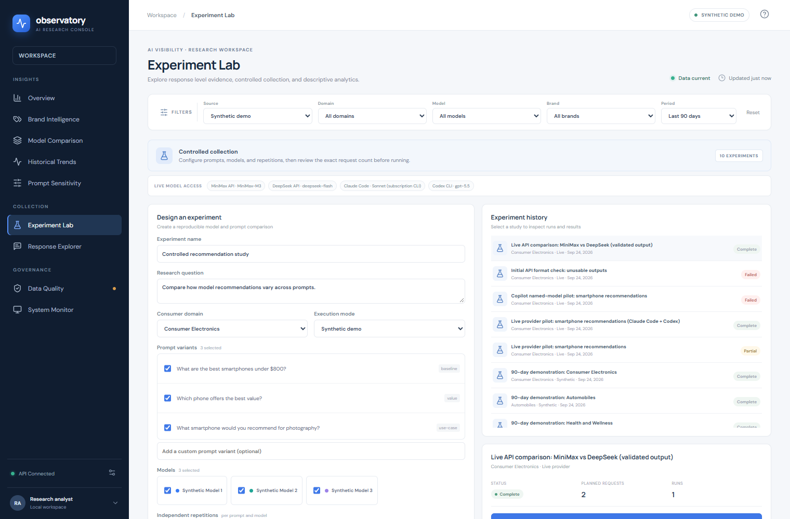

# AI Observatory

**LLM 品牌推荐洞察平台** · 研究演示平台

[English](README.md) · [简体中文](README.zh-CN.md) · [繁體中文](README.zh-TW.md)

AI Observatory 是一个本地研究原型，用于开展受控的提示词与模型实验、保存原始回答、提取品牌观察结果并查看描述性趋势。默认数据集为确定性生成的合成演示数据，并明确标注为演示数据；它不代表 ChatGPT、Claude、Gemini 或其他商业模型的实际测量结果。

## 界面截图



*总览页面：演示数据标明为模拟数据。*



*实验室页面：历史记录保留成功运行、失败尝试和排除项。*

## 架构

- **前端：** TypeScript、React 和 Vite，提供响应式分析视图、筛选、实验创建、回答检查、CSV/JSON 下载和人工审核。
- **API：** FastAPI 与 Pydantic；文档地址为 `http://localhost:8000/docs`。
- **持久化：** 默认使用 SQLite 的 SQLAlchemy ORM。配置 PostgreSQL 驱动后，可通过 `DATABASE_URL` 改用 PostgreSQL。
- **研究数据流程：** 提示词/模型/重复次数 → 运行记录 → 原始回答 → 版本化提取记录 → 规范化品牌观察 → 聚合分析或人工标注。
- **演示数据生成：** 使用固定随机种子，覆盖 5 个领域、3 个模拟模型和连续 90 天的历史数据。API 启动时仅在数据库为空时写入演示数据，不会在每次页面渲染时重复生成。

本地同步执行器适用于演示，不是持久化的分布式任务系统。实时运行支持 OpenAI、Anthropic、Google Gemini、MiniMax 和 DeepSeek 的 API 适配器，也支持检测运行 API 的计算机上已登录的 Claude Code、Codex 和 GitHub Copilot CLI。实时请求按顺序执行，需要明确确认，并会保存提供方错误。目前尚未实现搜索工具/引用、自动调度或价格估算；实时运行会禁用搜索，并将费用显示为不可用。

## 安装与启动（Windows PowerShell）

建议使用 Python 3.11 或更高版本。在项目目录中运行：

```powershell
py -3.11 -m venv .venv
.\.venv\Scripts\Activate.ps1
python -m pip install --upgrade pip
pip install -r requirements.txt
Copy-Item .env.example .env
python scripts\initialize_database.py
python scripts\generate_demo_data.py
```

首次安装前端依赖：

```powershell
cd frontend
npm install
cd ..
```

在两个终端分别启动 API 和前端：

```powershell
# 终端 1
uvicorn backend.main:app --reload
```

```powershell
# 终端 2
npm --prefix frontend run dev
```

打开 `http://localhost:5173`。Vite 开发服务器会将 API 请求代理到 8000 端口的 FastAPI。健康检查和交互式 API 文档分别位于 `http://localhost:8000/health` 和 `/docs`。

生成生产前端包：

```powershell
npm --prefix frontend run build
```

生成文件位于 `frontend/dist`。

项目默认使用 `APP_MODE=demo`、`DATABASE_URL=sqlite:///./ai_observatory.db` 和 `API_BASE_URL=http://localhost:8000`。可在 `.env` 中设置这些值。API 密钥留空也可以运行演示模式；演示模式不会发起付费 API 请求。

若要使用实时 API 提供方，请将一个或多个密钥填入本机 `.env`：`OPENAI_API_KEY`、`ANTHROPIC_API_KEY`、`GOOGLE_API_KEY`、`MINIMAX_API_KEY` 或 `DEEPSEEK_API_KEY`，然后重启后端。MiniMax 和 DeepSeek 适配器使用兼容 OpenAI 的 Chat Completions API；可通过对应设置覆盖基础 URL 和模型 ID。实验室会检测已登录的 Claude Code 与 Codex CLI。只有在 `COPILOT_CLI_MODEL_IDS` 中明确列出模型 ID 时才会启用 Copilot；由于 Auto 不会记录实际解析到的模型，Auto 路由已禁用。模型可用性取决于 Copilot 计划、CLI 版本和组织策略；不可用的模型请求会作为失败记录，且不会计入推荐统计。目前已登录的 Copilot CLI 账号只提供 Auto，因此在账号开放具名模型前，Copilot 会保持禁用。应用不会通过浏览器登录直接连接 Gemini Enterprise。Claude Pro 和 ChatGPT Plus 通过各自的本地 CLI 使用，并遵循对应服务的订阅条款。CLI 的用量或额度由相应服务管理。

选择 **Live** 后创建实验，查看计划请求数量，并勾选明确确认项后再运行。当前没有配置 API 定价，因此不会显示费用预估；API 提供方可能会对请求收费。一次实验不能混用演示模型和实时模型。单个提供方请求失败会保存为失败记录，但不会阻止其他请求继续执行。如果 API 进程在实时运行期间中断，请重启后端并再次运行该实验，系统会从已保存的请求继续。应用不会从终端输出读取 API 密钥；请将密钥保存在本机 `.env`，不要公开该文件。

## 仓库附带的研究快照

仓库包含 `ai_observatory.db` 时间点快照，因此克隆后即可查看实验历史。数据库包含确定性合成演示数据，以及少量实时试运行记录，包括 MiniMax、DeepSeek、Claude Code 和 Codex CLI 的成功回答、提供方模型可用性失败记录，以及因无法确认实际模型而标记为排除项的 Copilot Auto 回答。实时实验只使用一个智能手机提示词，仅用于描述性演示，不构成统计上有说服力的模型比较。数据库不含 API 密钥；凭据应填写在本机且已被 Git 忽略的 `.env` 文件中。

由于快照数据库已提交到仓库，之后在本机执行的新实验不会自动发布。若要分享较新的历史记录，请先检查数据库没有私人信息或密钥，再显式提交更新后的数据库。

## 交给编程代理的提示词

若希望编程代理克隆并在本机启动演示，可将以下提示词直接发送给代理：

```text
请克隆 https://github.com/rairurairu/ai-observatory-demo.git，协助我在本机运行 AI Observatory。先阅读 README.md 并按其中步骤操作。保留仓库自带的 ai_observatory.db 实验历史。使用演示模式；不要读取、打印、复制或上传任何 .env 文件或 API 密钥。不要运行会产生费用的实时实验，不要重置数据库，也不要推送任何更改。启动后端和前端后，告诉我本机访问网址以及如何停止两个服务。
```

## 五分钟演示

1. 打开 **Overview**，介绍合成数据标记、分母说明、按响应计算的提及率以及领域/模型筛选器。
2. 在 **Experiment Lab** 中创建一个 Automobiles 实验，选择全部 3 个模拟模型、3 个提示词变体和 2 次重复。运行前先检查配置。
3. 检查运行摘要，然后将运行结果导出为 JSON 或 CSV。
4. 打开 **Model Comparison**、**Prompt Sensitivity** 和 **Historical Trends**，讨论基于当前提示词集合的描述性差异。漂移提示仅用于说明。
5. 打开 **Response Explorer**，比较原始回答与有证据支持的提取观察、提及顺序和明确排名。
6. 在 **Data Quality** 中保存一条标注，并展示其持久化结果。最后打开 **System Monitor**，说明请求/失败计数，以及应用不会编造缺失的 Token 或费用数据。

## 测试

```powershell
pytest -q
```

测试覆盖种子 API、信息提取与明确排名、限定领域的比例聚合、保留重复项的演示运行、演示/实时数据隔离和标注持久化。

## 当前范围与限制

- **已实现：** 持久化规范化核心架构；演示数据生成；受控实验的增删改查和运行；实验/运行/回答 ID；OpenAI、Anthropic、Gemini、MiniMax、DeepSeek API 适配器；Claude Code、Codex 和 GitHub Copilot CLI 适配器；实时运行费用确认；逐请求失败保存；基于字典和别名/产品链接的确定性提取；带证据的提及记录；按响应统计品牌比例；模型比较；历史趋势；提示词变体比例；审核标注；运行状态计数与日志；回答导出；CSV 和 JSON；TypeScript/React 前端。
- **尚未实现：** 除 SDK 重试以外的提供方限流；实时费用估算；异步持久化任务队列；提供方搜索/引用；自动调度；高级分层推断和统计漂移检验；Parquet 快照。不要把说明性漂移提示理解为测量到的模型更新。
- 情感与属性提取使用谨慎的关键词规则。结果是研究辅助信息，并非经验证的 NLP 测量；规则无法明确判断时会保留为“未知”。

## 数据库说明

SQLite 架构通过 SQLAlchemy `create_all` 创建。若要开展长期研究，请在修改架构前加入 Alembic 迁移，并配置 PostgreSQL 驱动。原始回答文本和既有提取记录会保留；提取版本记录在 `extraction_runs.pipeline_version` 中。
